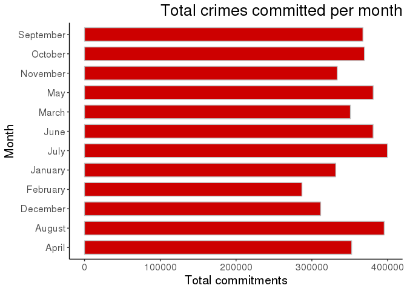

EDA
================
Harshit Bajpai
August 28, 2018

Loading Packages
================

``` r
suppressPackageStartupMessages(library(dplyr))
suppressPackageStartupMessages(library(ggplot2))
suppressPackageStartupMessages(library(lubridate))
suppressPackageStartupMessages(library(scales))
print("Packages Loaded")
```

    ## [1] "Packages Loaded"

Importing and preprocessing data
================================

The data was extracted from Chicago Police Department's CLEAR (Citizen Law Enforcement Analysis and Reporting) system. It has details of the crimes committed from 2005 - 2017. Initially, we import the data and pre processed it for the exploratory data analysis.

``` r
#reading datasets
dr1 <- read.csv("~/R/Chicago Crime/Chicago_Crimes_2008_to_2011.csv", stringsAsFactors = F)
dr1 <- dr1[,-c(1:3,6,12:24)]
sum(is.na(dr1))
```

    ## [1] 0

``` r
dr2 <- read.csv("~/R/Chicago Crime/Chicago_Crimes_2012_to_2017.csv", stringsAsFactors = F)
dr2 <- dr2[,-c(1:3,6,12:24)]
sum(is.na(dr2))
```

    ## [1] 0

``` r
#a problem arised while uploading the file due to quotes ("") in the strings. Thus, had to upload differently.
dr3 <- read.csv("~/R/Chicago Crime/Chicago_Crimes_2005_to_2007.csv", stringsAsFactors = F, quote= "", row.names = NULL)
dr3 <- dr3[,-c(1:3,6,12:24)]
#changing names of cols
names(dr3) <- names(dr2)
#removing blanks of date col
dr3 <- dr3[!(dr3$Date == ""), ]
#removing the bad entries
dr3 <- dr3[!(dr3$Arrest != "True" & dr3$Arrest != "False"), ]

#binded the data
data <- rbind(dr1,dr2,dr3)

#removing duplicate enteries
data <- data %>% distinct()

#date time format
suppressWarnings(data$Date <- mdy_hms(data$Date))

#converting to factors
data$Primary.Type <- as.factor(data$Primary.Type)
data$Description <- as.factor(data$Description)
data$Location.Description <- as.factor(data$Location.Description)

#removing NAs
data <- na.omit(data)

#isolating Year month and day from dates
data$"Year" <- year(data$Date)
data$"YearMon" <- paste(year(data$Date),"-",month(x = data$Date, label = TRUE, abbr = TRUE))
data$"Day" <- paste(year(data$Date),"-",month(x = data$Date, label = TRUE, abbr = TRUE), "-", day(data$Date))
data$Month <- format(data$Date, "%B")

#removing enteries of 2017
data <- data[!(year(data$Date) == 2017), ]
```

Monthly Crime
=============

This plot shows the total number of crimes that are committed every month. It is noticed that the number of crimes are increase during June - September period.

``` r
#grouping by year month
dT1 <- data%>% 
  select(YearMon) %>%
  group_by(YearMon) %>%
  summarize(count = n())

#converting yearmon col into std date format
dT1$YearMon <- fast_strptime(dT1$YearMon,"%Y - %b")

#sorting
dT1 <- dT1[order(as.Date(dT1$YearMon, format="%Y-%m-%d")),]
dT1$YearMon <- as.Date(dT1$YearMon)

#plotting 
ggplot(dT1, aes(YearMon, count)) + 
  geom_line(size=0.5, color = "grey") + geom_point(color = "red3")+
  scale_x_date(date_breaks = "1 year", labels =  date_format("%Y")) +
  xlab("Year") + ylab("# of crimes / month") + ggtitle("Monthly crimes (2005-2016)")+
  theme_classic() + theme(axis.title.x=element_text(size=15),  
        axis.title.y=element_text(size=15),  
        axis.text.x=element_text(size=12),  
        axis.text.y=element_text(size=12),
        plot.title = element_text(size=20,hjust = 0.5,color="black"))
```

 \# Yearly rolling sum This plot reaffirms the observation of last plot that overall the number of crimes have decreased exponentially from 2008-2014.

``` r
#grouping by year
dT2 <- data %>% 
  select(Year) %>%
  group_by(Year) %>%
  summarize(count = n())

#converting  year col into st date
dT2$Year <- fast_strptime(as.character(dT2$Year),"%Y")

#sorting
dT2 <- dT2[order(as.Date(dT2$Year, format="%Y-%m-%d")),]
dT2$Year <- as.Date(dT2$Year)

#plotting 
ggplot(data= dT2, aes( x = Year, count)) + 
  geom_line(size=0.5, color = "grey") + geom_point(color = "red3")+
  scale_x_date(date_breaks = "1 year", labels =  date_format("%Y")) +
  xlab("Year") + ylab("# of crimes") + ggtitle("Yearly rolling sum of crimes (2005-2016)")+
  theme_classic() + theme(axis.title.x=element_text(size=15),  
        axis.title.y=element_text(size=15),  
        axis.text.x=element_text(size=12),  
        axis.text.y=element_text(size=12),
        plot.title = element_text(size=20,hjust = 0.5,color="black"))
```

 \#Total committed crimes by Type It is important to know which crimes are most committed and the bar graph shows top 22 most committed crime in the Chicago region over the years. For a perspective, the least committed crime on the list is Homicide which has a total of 5704 observations.

``` r
#grouping by type of crime
dT3 <- data%>% 
  select(Primary.Type) %>%
  group_by(Primary.Type) %>%
  summarize(count = n())

#sorting by count
dT3 <- dT3[order(dT3$count, decreasing = T),]

#most committed crimes
MostComCrime <- as.character(dT3[1:10,]$Primary.Type)

#rearranging order of factors based on count variable
dT3$Primary.Type <- factor(dT3$Primary.Type , levels = dT3$Primary.Type[order(dT3$count)])

#ploting
ggplot(data = dT3[1:22,], aes(y= count, x= Primary.Type)) +
  geom_bar(stat="identity", color="grey", fill = "red3", width = 0.7) +
  coord_flip() + ggtitle("Total crimes segregated by type") + xlab("Type of Crime") + ylab("Total commitments") +
  theme_classic() + theme(axis.title.x=element_text(size=15),  
        axis.title.y=element_text(size=15),  
        axis.text.x=element_text(size=12),  
        axis.text.y=element_text(size=12),
        plot.title = element_text(size=20,hjust = 1,color="black"))
```


Total committed crime by month
==============================

This bar graph validates the notion that the number of crimes committed increases during summers and decrease in winters.

``` r
#grouping by months
dT4 <- data %>% 
  select(Month) %>%
  group_by(Month) %>%
  summarize(count = n())

dT4$Month <- as.factor(dT4$Month)

#to avoid exponential x scale
options(scipen=10000)

#ploting
ggplot(data = dT4, aes(y= count, x= Month)) + 
  geom_bar(stat="identity", color="grey", fill = "red3", width = 0.7) + coord_flip() +
  ggtitle("Total crimes committed per month") + xlab("Month") + ylab("Total commitments") + 
  theme_classic() + theme(axis.title.x=element_text(size=15),  
        axis.title.y=element_text(size=15),  
        axis.text.x=element_text(size=12),  
        axis.text.y=element_text(size=12),
        plot.title = element_text(size=20,hjust = 1,color="black"))
```

 \#Crimes committed by locations It is obvious to wonder which locations are most unsafe to be better prepared. In the plot we see Street, Residence, Apartment and Sidewalks are the hot-spots of the crimes.

``` r
#grouping by location
dT5 <- data %>% 
  select(Location.Description) %>%
  group_by(Location.Description) %>%
  summarize(count = n())

#sorting based on counts 
dT5 <- dT5[order(dT5$count, decreasing = T),]
dT5$Location.Description <- factor(dT5$Location.Description , levels = dT5$Location.Description[order(dT5$count)])

ggplot(data = dT5, aes(y= count, x= Location.Description)) + 
  geom_bar(data = subset(dT5[1:20,]),stat="identity", color="grey", fill = "red3", width = 0.7) + coord_flip() +
  ggtitle("Total crimes committed based on type of location") + xlab("Location") + ylab("Total commitments") +
  theme_classic() + theme(axis.title.x=element_text(size=15),  
        axis.title.y=element_text(size=15),  
        axis.text.x=element_text(size=12),  
        axis.text.y=element_text(size=12),
        plot.title = element_text(size=20,hjust = 1,color="black"))
```


