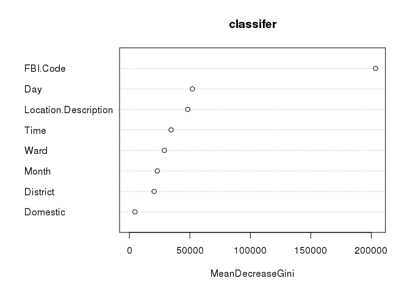

Prediction of Arrest using Random Forest
================

Loading Packages
================

``` r
suppressPackageStartupMessages(library(dplyr))
suppressPackageStartupMessages(library(caTools))
suppressPackageStartupMessages(library(randomForest))
suppressPackageStartupMessages(library(lubridate))
print("Packages Loaded")
```

    ## [1] "Packages Loaded"

Preprocessing Data
==================

The classification analysis is carried on data from 2012 - 2016. The date is stripped to create dummy variables for month, date and time. Also, location has been divided into 20 primary types(on basis of frequency of the crime being committed) and rest are labelled as non-primary. The data was filtered to removed enteries of 2017 and NAs.

``` r
data <- read.csv("~/R/Chicago Crime/Chicago_Crimes_2012_to_2017.csv", stringsAsFactors = F)

#removing duplicate enteries
dat_undup <- data %>% distinct()
#removing 1st col
dat_undup <- dat_undup[,-1]

#date time formatting
dat_undup$Date <- mdy_hms(dat_undup$Date)
dat_undup$Month <- month(dat_undup$Date, label = T, abbr = T)
dat_undup$Time <- substring(as.character(dat_undup$Date),12,22)
dat_undup$Time <- ifelse(grepl("PM",dat_undup$Time),as.integer(substring(dat_undup$Time,1,2))+12,
                         as.integer(substring(dat_undup$Time,1,2)))
dat_undup$Day <- day(dat_undup$Date)

#remvoing enteries of 2017
dat_undup <- dat_undup[!(year(dat_undup$Date) == 2017 | year(dat_undup$Date) == 2011), ]

#removing NAs
dat_undup <- na.omit(dat_undup)

#grouping by Location.Description
dT <- dat_undup %>% 
  select(Location.Description) %>%
  group_by(Location.Description) %>%
  summarize(count = n())
#sorting by count
dT <- dT[order(dT$count, decreasing = T),]
#most committed crimes
MostComLoc <- as.vector(dT[1:20,]$Location.Description)
dat_undup$Location.Description <- ifelse(dat_undup$Location.Description %in% MostComLoc,dat_undup$Location.Description,"Non-Primary")
```

Random Forest Classifier
========================

The random forest decision trees model gives accuracy of 87%.

``` r
set.seed(101)
dat_rf <- dat_undup[,c(8,9,10,12,13,15,23,24,25)]
dat_rf$Arrest <- as.factor(dat_rf$Arrest)
dat_rf$District <- as.factor(dat_rf$District)
dat_rf$Domestic <- as.factor(dat_rf$Domestic)
dat_rf$Ward <- as.factor(dat_rf$Ward)
dat_rf$Location.Description <- as.factor(dat_rf$Location.Description)
dat_rf$FBI.Code <- as.factor(dat_rf$FBI.Code)
dat_rf$Day <- as.factor(dat_rf$Day)
dat_rf$Time <- as.factor(dat_rf$Time)
dat_rf$Month <- as.factor(dat_rf$Month)

split <- sample.split(dat_rf$Arrest, SplitRatio = 0.9)
trainrf <- subset(dat_rf,split == T)
testrf <- subset(dat_rf, split == F)
classifer <- randomForest(Arrest ~ ., ntree = 100, data = trainrf)

arrest_pred <- predict(classifer,newdata = testrf[,-2])

cm <- table(testrf[,2],arrest_pred)
cm
```

    ##        arrest_pred
    ##          False   True
    ##   False 100828   4022
    ##   True   14082  23024

``` r
paste("Accuracy is",((cm[1,1]+ cm[2,2])/nrow(testrf)), sep = " ")
```

    ## [1] "Accuracy is 0.872467525148638"

``` r
varImpPlot(classifer,sort =  T)
```


